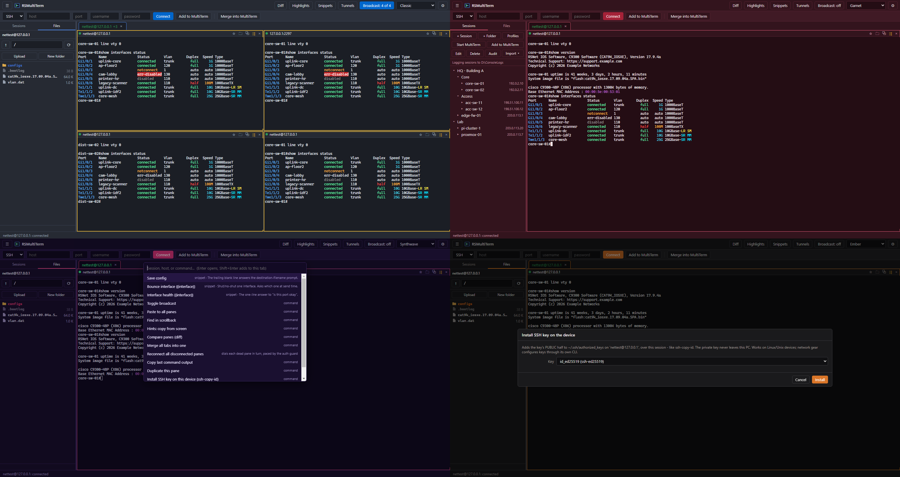

# RSMultiTerm

A multi-session terminal emulator for network and Linux administration.
SSH, Telnet, and Serial in a dynamic N-pane grid, with context highlighting,
multi-exec broadcast, an SFTP file browser, SSH key management with in-app
ssh-copy-id, and session sync that keeps credentials out of shared files.



## Why it exists

- **The split view IS the multi-exec grid.** Open any number of sessions in
  one tab and they lay out dynamically - 2, 3, 5, 7 panes, whatever you
  selected. Broadcast keystrokes to all of them with an unmissable warning
  border, and any multi-line paste confirms with the exact payload first.
- **SSH keys are the default path, end to end.** Credential profiles pick
  key, agent, or password; the key picker lists what is actually in your
  `~/.ssh`; and "Install SSH key on this device" is ssh-copy-id from inside
  the session you already have open - connect with a password once, and the
  password is history. The private key never leaves your machine.
- **Passwords, where they must remain, are stored the honest way.** The
  prompt offers "remember this password" encrypted with your Windows
  sign-in (DPAPI) - and commits the save only after the password has
  actually opened a device, so a typo is never stored. Prompt-only mode
  (memory, never disk) is one dropdown away, built for daily-rotation
  policies.
- **Context highlighting with animation.** `up` green, `down` red,
  `err-disabled` flashing - out of the box, and every rule is editable,
  ordered (first match wins), and shareable.
- **Auth-lockout protection built into connecting.** A bulk connect sends
  one canary per credential profile before fanning out, and the first auth
  failure halts everything else using that profile - a stale password costs
  one attempt, not thirty. Built for AD/TACACS lockout policies.
- **Sync without shared secrets.** Point two machines (or a team) at one
  JSON file on a share; the app polls it, shows an approve/merge diff
  (three-way, so it only asks about actual incoming changes), and publishes
  with a lock. Sessions reference credential profiles by NAME, so the file
  never contains usernames or passwords.

Also: SSH jump hosts (chainable, pooled - thirty sessions through one
gateway authenticate once), port forwards (-L, -D SOCKS, -R) over saved
sessions, per-session logging (ANSI-stripped and timestamped, or raw -
announced in the sidebar, never silent), OSC 133 semantic prompts (jump
between commands, copy last output, failed commands flagged red), a
command palette (Ctrl+Shift+P), snippets with `{{param}}` placeholders,
output diffing between panes, TOFU host keys with a hard block on
mismatch, quick-connects that save into the session tree with one click,
a MobaXTerm `.mxtsessions` import wizard that converts baked-in usernames
to credential profiles, and both mouse modes
(select-copies/right-click-pastes and right-click-menu -
Ctrl+right-click always does the other one).

Deliberately absent: RDP, VNC, X11, WSL, local shells, and the utility
grab-bag. This is a terminal for SSH and text.

## Install

Grab the installer or the portable exe from Releases. Both are unsigned -
this is a personal project without a code-signing certificate - so
SmartScreen will warn on first run ("More info" > "Run anyway"). Every
release publishes SHA-256 hashes in `SHA256SUMS.txt`; verify a download
with:

```
Get-FileHash .\RSMultiTerm-x.y.z-portable.exe -Algorithm SHA256
```

For the portable exe, drop a file named `rsmultiterm-portable.txt` next to
it and all state (sessions, profiles, logs) lives beside the exe instead
of `%APPDATA%` - fully self-contained on a share or USB stick.

## Quickstart (development)

Needs Node 22+.

```
npm install
npm start
```

`npm test` runs the whole check chain - no test framework, plain node
scripts, every one of them planted-defect-verified.

To try it against nothing at all, start the fixture switches:

```
node tools/test-ssh-server.js 2222 core-sw-01
node tools/test-telnet-server.js 2323 dist-sw-02
```

and connect to 127.0.0.1:2222 (nettest / nettest). The SSH fixture also
serves SFTP and acts as a jump host.

## Building

```
npm run release
```

runs the test chain, then produces the NSIS per-user installer and the
portable exe under `dist/`, with `SHA256SUMS.txt` beside them.

Linux (AppImage and `.deb`) is configured and the code paths are
platform-aware - window icon, default font, SSH agent, serial device
permissions, and secret storage all branch correctly - but no Linux build
is published yet, and the packaging has not been run on a desktop Linux
machine:

```
npx electron-builder --linux
```

One Linux note worth knowing before that lands: saved passwords need a
system keyring (gnome-keyring or KWallet). Without one, Chromium's
fallback "encrypts" with a hardcoded key, so the app withholds the save
option entirely and uses memory-only prompt mode rather than pretending.

## Dependencies

Runtime: `ssh2`, `serialport`. That is the entire tree - everything else is
Electron itself and vendored static files, auditable in `public/vendor/`
and hash-checked against their npm originals by `npm test`.

## Data and privacy

- `profiles.json` (usernames, DPAPI-encrypted passwords, key paths) never
  leaves your machine and is never part of any export, publish, or sync -
  the outbound serializer is a field whitelist, so unknown fields cannot
  leak by accident.
- A sync file contains hostnames, folder structure, and profile *names*
  only. See `samples/team-sessions.sample.json`.
- Session logs are on by default (a change window that silently did not
  log is the worst surprise) and the sidebar says so, with the folder.
  Per-session and per-folder off switches in the editor; the folder is
  configurable in Settings.
- The security posture, threat model, and accepted risks are written up in
  [docs/security-review-2026-08.md](docs/security-review-2026-08.md).

## License

[Unlicense](LICENSE) - public domain.
